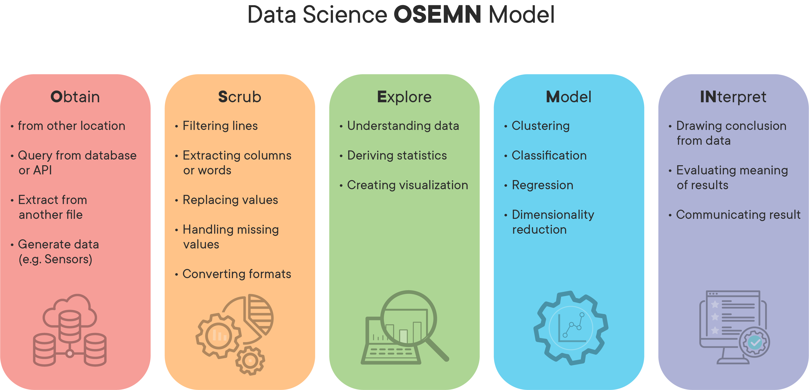
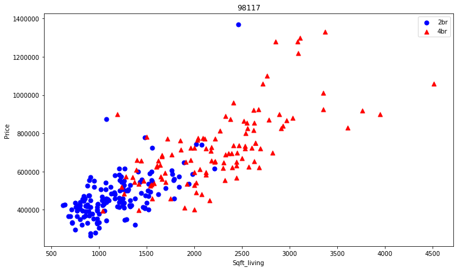

### This project entails utilizing the kc_house_data set to predict housing prices making use of a multivariate linear regression model. The initial dataset consists well over twenty-thousand rows spanding twenty-one columns at approx: 3.5MB. The price is the dependant variable and is the targeted prediction in this notebook, the features are the independent variables. The columns and descriptions in the dataset are as follows:
* id - a notation for a house
* date - date house was sold
* price - price is prediction target
* bedrooms - number of bedrooms/house
* bathrooms - number of bathrooms/house
* sqft_living - square footage of the home
* sqft_loft - square footage of the lot
* floors - total floors (levels) in the house
* waterfront - house which has a view to a waterfront
* view - has been viewed
* condition - how good the condition is overall(1-5 scale, 5 being excellent)
* grade - overall grade given to the housing unit, based on King County grading system
* sqft_above - square footage of the house apart from the basement
* sqft_basement - square footage of the basement
* yr_built - year house was constructed


### Exploratory data analysis (EDA) questions addressed in this notebook are as follows:
1. *How were missing or immiscible data handled?*
1. *What additional features were added that weren't present in the original data set?*
1. *How were possible outliers delt with?*


> This notebook will be following the **OSEMIN** processing model and is documented accordingly



### How were NaN, null, or immiscible values being handled?
sqft_basement had some immisicible values, namely '?' these were replaced by 0 as a no value.
 
```python
data['sqft_basement'] = data['sqft_basement'].replace('?', '0')
data['sqft_basement'] = data['sqft_basement'].astype(float)
```
### What additional features were added that weren't present in the original data set?
Price_per_sqft a common real estate metric was added and has a direct impact on the OLS Regression Results, from an 0.886 R-squared value (Adj R 0.886) to a R-squared value 0.612 without this feature (Adj R 0.612)

```python

|-----------------------||OLS Regression Results WITHOUT price_per_sqft||-----------------                   
|:----------------------||:---------------------:||----------------:|
|Dep. Variable           |price                  |R-Squared:        |0.612
|Model:                  |OLS                    |Adj. R-Squared    |0.612
|Method:                 |Least Squares          |F-stastic:        |2486.
|Date:                   |Monday                 |Prob (F-statistic)|0.00
|Time:                   |12:23:53               |Log-Likelihood:   |-14900
|No. Observation         |15762                  |AIC:              |2.982e+04
|Df Residuals:           |15682                  |BIC:              |2.991e+04
|Df Model:               |79                  
|Covariance Type:        |nonrobust  
|Omnibus:                |15681.994              |Durbin-Watson:    |1.974
|Prob(Omnibus):          |0.000                  |Jarque-Bera (JB): |785829.041
|Skew:                   |3.027                  |Prob(JB):         |0.00
|Kurtosis:               |37.057                 |Cond. No.         |4.46
    
# adding price_per_sqft to features
data_scrub['price_per_sqft'] = data_z['price'] / data_z['sqft_living']

    
|-----------------------||OLS Regression Results WITH price_per_sqft||-----------------                   
|:----------------------||:---------------------:||----------------:|
|Dep. Variable           |price                  |R-Squared:        |0.886
|Model:                  |OLS                    |Adj. R-Squared    |0.886
|Method:                 |Least Squares          |F-stastic:        |1.114e+04
|Date:                   |Monday                 |Prob (F-statistic)|0.00
|Time:                   |12:23:53               |Log-Likelihood:   |-5243.0
|No. Observation         |15762                  |AIC:              |1.051e+04
|Df Residuals:           |15750                  |BIC:              |1.060e+04
|Df Model:               |11                  
|Covariance Type:        |nonrobust  
|Omnibus:                |16477.760              |Durbin-Watson:    |1.974
|Prob(Omnibus):          |0.000                  |Jarque-Bera (JB): |785829.041
|Skew:                   |4.565                  |Prob(JB):         |0.00
|Kurtosis:               |104.769                |Cond. No.         |878
```


### How were possible outliers delt with?
Initial attempt to limit possible outliers was through an IRQ filter sort of speak, which resulted in a data loss of 282 rows, no direct impact on OLS Regression Results noticed. 
```python
# IRQ for each column
Q1 = data_z.quantile(0.25)
Q3 = data_z.quantile(0.75)
IQR = Q3 - Q1
print(IQR)

id               5.207564e+09
price            3.075000e+05
bedrooms         1.000000e+00
bathrooms        1.000000e+00
sqft_living      1.090000e+03
sqft_lot         5.487250e+03
floors           1.000000e+00
waterfront       0.000000e+00
view             0.000000e+00
condition        1.000000e+00
grade            1.000000e+00
sqft_above       9.800000e+02
yr_built         4.400000e+01
yr_renovated     0.000000e+00
zipcode          8.400000e+01
lat              2.127250e-01
long             2.060000e-01
sqft_living15    8.500000e+02
sqft_lot15       4.914500e+03
dtype: float64

data_z = data_z[~((data_z < (Q1 - 1.5 * IQR)) |(data_z > (Q3 + 1.5 * IQR))).any(axis=1)]
data_z.shape
(10929, 21)
    
```

A prevalent real estate metric used and missing in this data set is price_per_sqft. This was calculated and added to the data and utilized to find any underlying outliers like comparing dwelling prices by size and price. This can be searched by zipcode and comparing bedroom combinations (ie 2bdr vs 4bdr). Although it's completely feasible for tauted luxury dwelling to be marketed and priced accordingly. 

```python
# comparing price between home size 
# some outliers indicate that some 2br dwellings are more expensive than 5br's in the same zipcode and similiar sqft. 

def scatter(df, zipcode):
    bed_a = data_scrub[(data.zipcode == zipcode) & (data.bedrooms == 2)] 
    bed_b = data_scrub[(data.zipcode == zipcode) & (data.bedrooms == 4)]
    
    plt.rcParams['figure.figsize'] = (12,7)
    plt.scatter(bed_a.sqft_living, bed_a.price, color = 'b', label = '2br', s= 50)
    plt.scatter(bed_b.sqft_living, bed_b.price, marker= '^', color = 'r', label = '4br', s= 50)

    plt.xlabel('Sqft_living')
    plt.ylabel('Price')
    plt.title(zipcode)
    plt.legend()

scatter(data, 98117)
```


### Coefficient findings and Answers:

1. The **bedrooms** feature has a p-value that is greater than the significance level (0.05) and thus is insufficient evidence to conclude that a non-zero correlation exists. There would be no consequences to this feature being dropped. T
1. **Sqft_living** was an indentical metric to sqft_above and the two shared a correlation holding I surmise identical values, sqft_living has a p-value less than the significance level of 0.05 and is enough to evidence to reject the null hypothesis were the data to favor the hypothesis that there isn't a non-zero correlation. 
1. The **price_per_sqft** feature was added and had a direct impact on the R-Squared value 0.886 it too showed a p-value less than the significant level of 0.05. I did gather that each independent variable needs to "interact" with other independent variables to produce a significant relationship here both the price and sqft_living features. The more precise metric std err of 2.78 may explain this relationship to the dependent variable a value of 3.5 being "too large". 

|------------------|:coef        |std err    |t             | P>|t|     |
|:-----------------|:-----------:|:---------:|:------------:|:---------:|:----------:|:-----
|Intercept         |-1.4283      |0.008      |-182.754      |0.000      |-1.444      |-1.413
|**bedrooms**          |-0.0059      |0.003      |-1.711        |0.087      |-0.013      |0.001
|bathrooms         | 0.0298      |0.005      |6.541         |0.000      |0.021       |0.039
|**sqft_living**       |0.7086       |0.006      |127.884       |0.000      |0.698       |0.719
|sqft_lot          |-0.0244      |0.003      |-8.840        |0.000      |-0.030      |-0.019
|floors            |-0.0258      |0.003      |-7.773        |0.000      |-0.032      |-0.019
|waterfront        | 0.0660      |0.003      |22.151        |0.000      |0.060       |0.072
|view              | 0.0242      |0.003      |7.638         |0.000      |0.018       |0.030
|condition         | 0.0157      |0.003      |5.537         |0.000      |0.010       |0.021
|grade             |0.0350       |0.005      |7.394         |0.000      |0.026       |0.044
|zipcode           |-0.0114      |0.003      |-4.007        |0.000      |-0.017      |-0.006
|**price_per_sqft**    | 0.0054      |2.78e-05   |194.638       |0.000      |0.005       |0.005


### Interpretation
The model is a close fit based on the R-squared value (and Adj R-squared) of 0.886 close to 1.0, the 
Adj R-squared value is identical indicating that there are no useless features selected in the model and
that no or few penalites are being calculated giving the F-statistic value 1.114e+04 and Prob (F-statistic)
of 0.00, there is no linear relationship between the target variable and the independent variables. The 
subsequent t test (higher the better, see price_per_sqft) and corresponding P value indicate that the null hypothesis
can be rejected. The bedrooms feature has a small t- value and a large p- value which would fail to reject the 
null hypothesis, this feature would not be feasible in making a prediction. All the other features selected would reject 
null hypothesis. 


